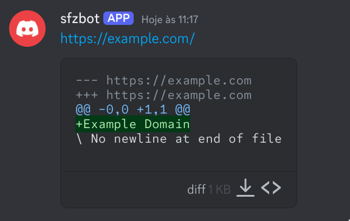
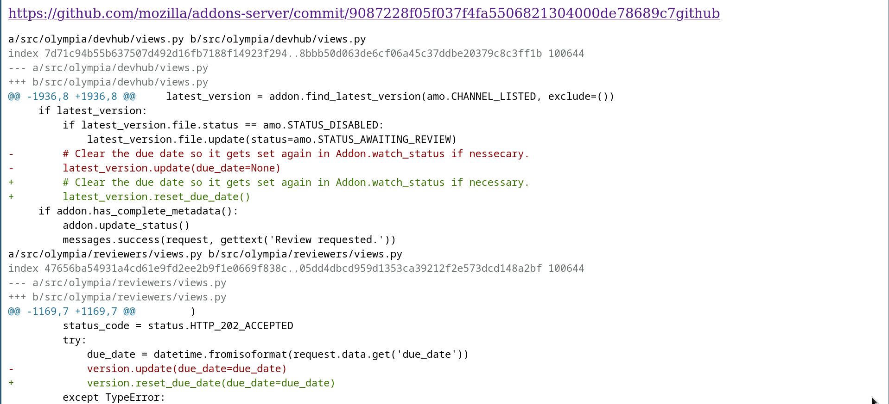

monitor has two main funcionalities:
- Crawl a page every X amount of time.
- Clone a repo and diff it.

It then sends an alert if it matches the filter.

# Usage
Its just an web app, so you can just curl it.
```bash
curl http://localhost:3000/crawl/c -d 'profile=html' -d 'selector=h1' -d 'url=https://example.com'
# Done: https://example.com
```

```bash
curl http://localhost:3000/repos/c -d 'url=https://github.com/shafouz/monitor' -d 'files=["routes.py"]'
# Repo created
```

# endpoints

- home page
`/`
- show all endpoints
`/crawl`
- show all repos
`/repos`
- show all diffs
`/diffs`
- show diff by id
`/diff/{id}`
- returns OK
`/health`
- create endpoint
`/crawl/c`
- update endpoint
`/crawl/u`
- delete endpoint
`/crawl/d`
- run every endpoint by schedule
`/crawl/run`
- run single endpoint
`/crawl/run_single`
- create repo 
`/repos/c`
- update repo
`/repos/u`



